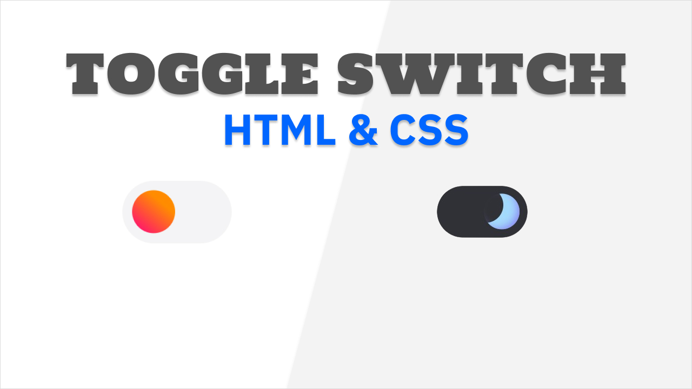

# Stylish Toggle Switch Button 🔄✨

This repository contains the source code for a **Stylish Toggle Switch Button** built with **HTML** and **CSS**. This component is perfect for modern web designs, featuring smooth transitions and a customizable layout. 🚀

## 🛠️ Features

- **Modern Design**: Sleek and minimalist toggle switch button.
- **Smooth Transitions**: Seamless animations for a better user experience.
- **Customizable**: Use CSS variables for easy adjustments in size, color, and layout.
- **Responsive**: Perfect for all screen sizes.

## 📜 Code Structure

- **HTML**: Basic structure for the toggle switch.
- **CSS**: Styling and animations for the toggle switch.

## 📦 Installation

Simply copy the HTML and CSS files into your project to use the toggle switch.

## 🙌 Contributions

If you have new utility ideas or enhancements for existing components:

1. Fork the repository.
2. Create a new branch for your changes.
3. Submit a pull request with your updates.

---

## 📜 License

This project is licensed under the [MIT License](../LICENSE).  
Feel free to use these utilities in your personal or commercial projects with attribution.

---

Happy coding! 🚀
